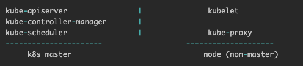

## Basic knowledge in k8s

### k8s的部署架构

k8s有两类资源，分别是master和node。
1. master: 负责管理整个集群，例如，对应用进行调度(扩缩)、维护应用期望的状态、对应用进行发布等。
2. node: 集群中的宿主机（可以是物理机也可以是虚拟机），每个node上都有一个agent，名为kubelet，用于跟master通信。同时一个node需要有管理容器的工具包，用于管理在node上运行的容器(docker或rkt)。一个k8s集群至少要有3个节点。kubelet通过master暴露的API与master通信，用户也可以直接调用master的API做集群的管理。

