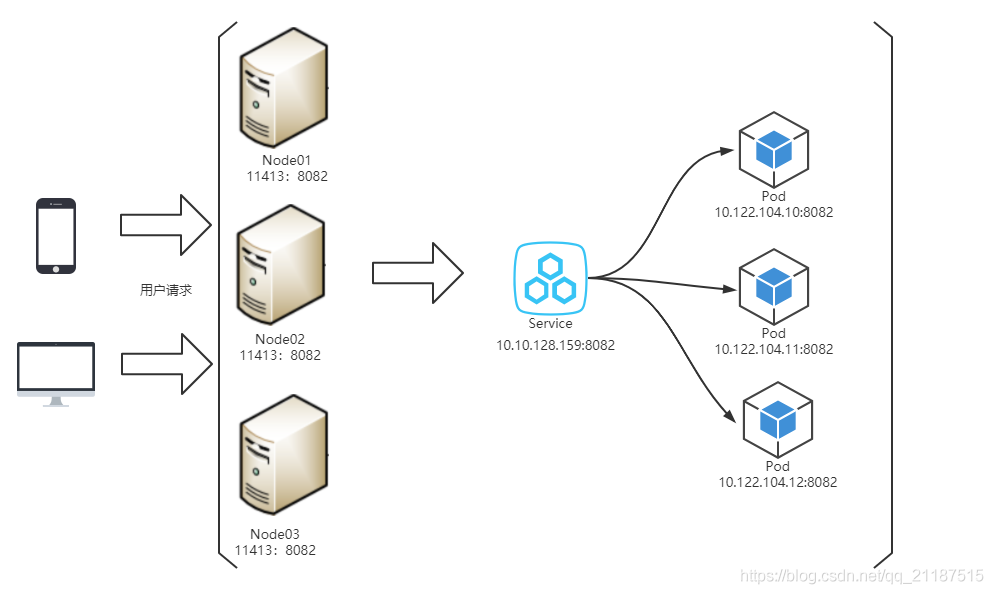

## Different IP and port in k8s

### Three types of IP in k8s
- Node IP: Node节点的IP地址，即物理网卡的IP地址
- Pod IP: Pod的IP地址，为虚拟IP地址(Pod可以包含多个docker, 这些docker使用同一个IP)
- Cluster IP: Service的IP地址，为虚拟IP地址

#### Node IP
```markdown
# kubectl describe node master1 | grep InternalIP
  InternalIP:  10.151.30.11
# kubectl describe node node1 | grep InternalIP
  InternalIP:  10.151.30.22
```

#### Pod IP
```markdown
apiVersion: v1
kind: Pod
metadata:
  name: pod-ip
spec:
  volumes:
  - name: html
    emptyDir: {}
  containers:
  - name: 1st
    image: nginx
    volumeMounts:
    - name: html
      mountPath: /usr/share/nginx/html
  - name: 2nd
    image: debian
    volumeMounts:
    - name: html
      mountPath: /html
    command: ["/bin/sh", "-c"]
    args:
      - while true; do
          date >> /html/index.html;
          sleep 1;
        done
```
```markdown
# kubectl describe pod pod-ip
Name:         pod-ip
...
Status:       Running
IP:           192.168.1.3
IPs:
  IP:  192.168.1.3
# kubectl describe pod mc1
Name:         mc1
...
Status:       Running
IP:           192.168.1.2
IPs:
  IP:  192.168.1.2
```
```markdown
# docker ps
CONTAINER ID   IMAGE                  COMMAND                  CREATED       STATUS       PORTS     NAMES
abb111a24d66   debian                 "/bin/sh -c 'while t…"   4 hours ago   Up 4 hours             k8s_2nd_pod-ip_default_84f08e8e-979b-4cf5-b0c7-106f4316b0ed_0
...
```
```markdown
# docker exec -ti abb11 /bin/bash
```
```markdown
# ip addr show eth0
3: eth0@if10: <BROADCAST,MULTICAST,UP,LOWER_UP> mtu 1450 qdisc noqueue state UP group default 
    link/ether 12:9d:4d:cc:7a:1b brd ff:ff:ff:ff:ff:ff link-netnsid 0
    inet 192.168.1.3/24 brd 192.168.1.255 scope global eth0
       valid_lft forever preferred_lft forever
```
#### Cluster IP

### 三种IP网络间的通信
service地址和pod地址在不同网段，service地址为虚拟地址，不配在pod上或主机上，外部访问时，先到Node节点网络，再转到service网络，最后代理给pod网络

